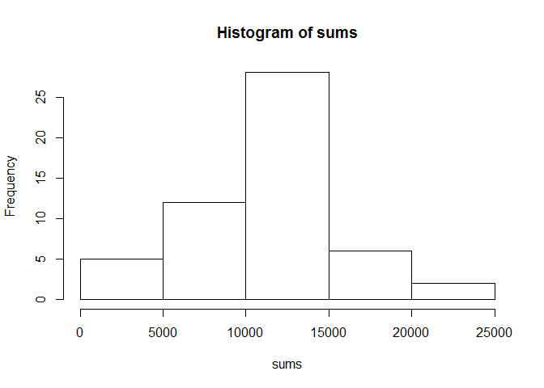
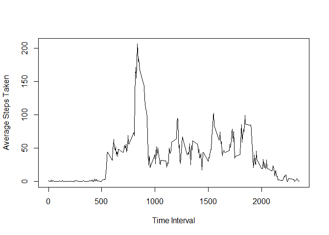
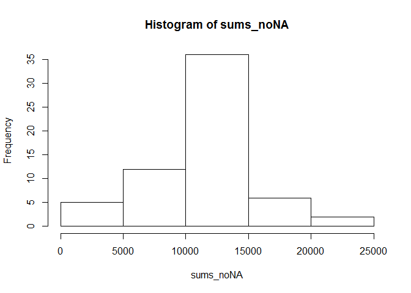

# Reproducible Research: Peer Assessment 1


## Loading and preprocessing the data


```r
activity <- read.csv("C:/Users/Kandy.WAZZABI/Desktop/R Programming/activity.csv")
date <- as.POSIXct(activity$date, format = "%Y-%m-%d")
steps <- activity$steps
interval <- activity$interval
```

## What is mean total number of steps taken per day?
  
Total number of steps taken per day:


```r
tapply(steps, date, sum)
```

```
## 2012-10-01 2012-10-02 2012-10-03 2012-10-04 2012-10-05 2012-10-06 
##         NA        126      11352      12116      13294      15420 
## 2012-10-07 2012-10-08 2012-10-09 2012-10-10 2012-10-11 2012-10-12 
##      11015         NA      12811       9900      10304      17382 
## 2012-10-13 2012-10-14 2012-10-15 2012-10-16 2012-10-17 2012-10-18 
##      12426      15098      10139      15084      13452      10056 
## 2012-10-19 2012-10-20 2012-10-21 2012-10-22 2012-10-23 2012-10-24 
##      11829      10395       8821      13460       8918       8355 
## 2012-10-25 2012-10-26 2012-10-27 2012-10-28 2012-10-29 2012-10-30 
##       2492       6778      10119      11458       5018       9819 
## 2012-10-31 2012-11-01 2012-11-02 2012-11-03 2012-11-04 2012-11-05 
##      15414         NA      10600      10571         NA      10439 
## 2012-11-06 2012-11-07 2012-11-08 2012-11-09 2012-11-10 2012-11-11 
##       8334      12883       3219         NA         NA      12608 
## 2012-11-12 2012-11-13 2012-11-14 2012-11-15 2012-11-16 2012-11-17 
##      10765       7336         NA         41       5441      14339 
## 2012-11-18 2012-11-19 2012-11-20 2012-11-21 2012-11-22 2012-11-23 
##      15110       8841       4472      12787      20427      21194 
## 2012-11-24 2012-11-25 2012-11-26 2012-11-27 2012-11-28 2012-11-29 
##      14478      11834      11162      13646      10183       7047 
## 2012-11-30 
##         NA
```
  
Histogram:


```r
activitySplit <- split(activity, activity$date)
sums <- vector()
for (i in 1:(length(activitySplit))) {
    newSum <- sum(activitySplit[[i]][, 1])
    sums <- append(sums, newSum)    
}

hist(sums)
```

 
  
Mean number of steps taken each day:


```r
mean(sums, na.rm = TRUE)
```

```
## [1] 10766.19
```
  
Median number of steps taken each day:


```r
median(sums, na.rm = TRUE)
```

```
## [1] 10765
```

## What is the average daily activity pattern?
  
Time Series Plot:


```r
activityInterval <- split(activity, activity$interval)
averages <- vector()
interval <- vector()
for (i in 1:(length(activityInterval))) {
    newAverage <- mean(activityInterval[[i]][, 1], na.rm = TRUE)
    averages <- append(averages, newAverage)    
}
for (i in 1:(length(activityInterval))) {
    newInterval <- activityInterval[[i]][1, 3]
    interval <- append(interval, newInterval)
}

plot(interval, averages, type = 'l', xlab = "Time Interval", ylab = "Average Steps Taken")
```

 
  
5 Minute Interval with Highest Average:


```r
maxSteps <- max(averages)
index <- match(c(maxSteps), averages)
interval[index]
```

```
## [1] 835
```

## Imputing missing values
  
Total Number of NA values:


```r
sum(is.na(activity$steps))
```

```
## [1] 2304
```
  
Here, I use the mean number of steps for each interval to replace NA values with
the respective mean for that interval.
  
Strategy/Code Used:


```r
library(data.table)

activity_noNA <- as.data.table(activity)
activity_noNA <- activity_noNA[,meanSteps:=mean(steps, na.rm = TRUE), by = interval]

stepsVector <- vector()

for (i in 1:17568) {
    if (is.na(activity_noNA[i, steps])) {
        stepsVector <- append(stepsVector, activity_noNA[i, meanSteps])
    }

    else {
        stepsVector <- append(stepsVector, activity_noNA[i, steps])
    }
}

activity_noNA <- activity_noNA[, steps:= stepsVector]
activity_noNA <- activity_noNA[, meanSteps:= NULL]
activity_noNA
```

```
##            steps       date interval
##     1: 1.7169811 2012-10-01        0
##     2: 0.3396226 2012-10-01        5
##     3: 0.1320755 2012-10-01       10
##     4: 0.1509434 2012-10-01       15
##     5: 0.0754717 2012-10-01       20
##    ---                              
## 17564: 4.6981132 2012-11-30     2335
## 17565: 3.3018868 2012-11-30     2340
## 17566: 0.6415094 2012-11-30     2345
## 17567: 0.2264151 2012-11-30     2350
## 17568: 1.0754717 2012-11-30     2355
```
  
Histogram of total number of steps taken each day after missing values are imputed:


```r
activity_noNASplit <- split(activity_noNA, activity_noNA[, date])
sums_noNA <- vector()
for (i in 1:(length(activity_noNASplit))) {
    newSum <- sum(activity_noNASplit[[i]][, steps])
    sums_noNA <- append(sums_noNA, newSum)
}

hist(sums_noNA)
```

 
  
Mean with NA values filled:


```r
mean(sums_noNA)
```

```
## [1] 10766.19
```
  
Median with NA values filled:

```r
median(sums_noNA)
```

```
## [1] 10766.19
```
  
These values do not seem to differ much, if any, from the first part of the assignment.  This is probably due to the way I filled the values in using the means of the intervals.  It just lumped more values right in the middle not affecting the mean or median.  

## Are there differences in activity patterns between weekdays and weekends?
  
Panel Plot:


```r
library(lattice)
library(latticeExtra)
```

```
## Loading required package: RColorBrewer
```

```r
activity_noNA <- activity_noNA[, date:=as.POSIXct(date, format = "%Y-%m-%d")]
activity_noNA <- activity_noNA[, weekday:= weekdays(date)]

weekdays <- c('Monday', 'Tuesday', 'Wednesday', 'Thursday', 'Friday')
activity_noNA <- activity_noNA[, weekday_or_weekend:= factor((weekday %in% weekdays) + 1L,
             levels=1:2, labels = c('weekend', 'weekday'))]
activity_noNA <- activity_noNA[,weekday:= NULL]
activity_noNA
```

```
##            steps       date interval weekday_or_weekend
##     1: 1.7169811 2012-10-01        0            weekday
##     2: 0.3396226 2012-10-01        5            weekday
##     3: 0.1320755 2012-10-01       10            weekday
##     4: 0.1509434 2012-10-01       15            weekday
##     5: 0.0754717 2012-10-01       20            weekday
##    ---                                                 
## 17564: 4.6981132 2012-11-30     2335            weekday
## 17565: 3.3018868 2012-11-30     2340            weekday
## 17566: 0.6415094 2012-11-30     2345            weekday
## 17567: 0.2264151 2012-11-30     2350            weekday
## 17568: 1.0754717 2012-11-30     2355            weekday
```

```r
f <- activity_noNA[,weekday_or_weekend]
splitData <- split(activity_noNA, f)

weekendSteps <- aggregate(steps ~ interval, data = splitData[[1]], mean)
weekdaySteps <- aggregate(steps ~ interval, data = splitData[[2]], mean)

weekendPlot <- xyplot(steps ~ interval, data = weekendSteps, type = 'l')
weekdayPlot <- xyplot(steps ~ interval, data = weekdaySteps, type = 'l')

plots <- c(Weekday = weekdayPlot, Weekend = weekendPlot, x.same = TRUE, y.same = TRUE,
           layout = c(1, 2))  

plots
```

 
